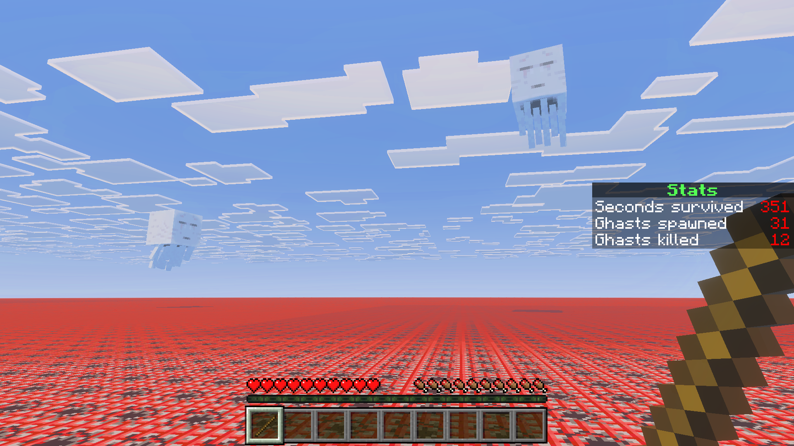

# Protect the CPU

> Created by [Th3Emilis](https://github.com/th3emilis)

Inspired by a popular internet trend, Protect the CPU is a minigame where your goal is to survive for as long as possible by deflecting the fireballs that ghasts shoot at you. One mistake is all it takes to have the entire TNT floor crumble under your feet. So, unless you are really curious about what your CPU can handle, you’d better watch out for the ghasts!

## How to Play

Use your hand or the stick you are given during the tutorial to hit back the fireballs that ghasts shoot at you.

When the tutorial ends and ghasts start spawning, the scoreboard on the right side of your screen will keep track of all the seconds you manage to stay alive, as well as how many ghasts spawn and how many you kill.

At specific time intervals the frequency of ghasts will increase, so be ready to up your strategy if you want to survive long enough to beat the game!

Keep in mind that if a fireball hits the ground, it’s game over! Don’t worry too much about your CPU though, as there is a system to stop the explosion once you are dead. The screenshot above is only for dramatic effect.

## Terms of Use

By downloading, installing, accessing, using or interacting in any way with this map, you agree to be bound by the following terms:
- **Attribution** — You must give proper credit to the creator if you reference, use or feature any of the map contents (playthrough, files, etc.) in your own content, such as videos, blogs, or social media posts.
- **No Redistribution** — You may not reproduce, redistribute or republish the map in any form or by any means. You may not share the direct download link or any user-generated link to the map. Use one of the [official links](https://github.com/th3emilis/protect-the-cpu/blob/main/OFFICIAL_LINKS.md).
- **Non-Commercial** — You may not use the map for any commercial or revenue-generating purposes, such as advertising, selling or renting. You may not charge any fees or request any donations for accessing or using the map.
- **No Derivates** — You can remix, adapt or build upon the map for your own private use, but you may not share, distribute, or make available the modified version of the map to any third party.

## Feedback

For any suggestions, bugs or help, feel free to [join the Discord community](https://discord.gg/skqthyTkBQ).
